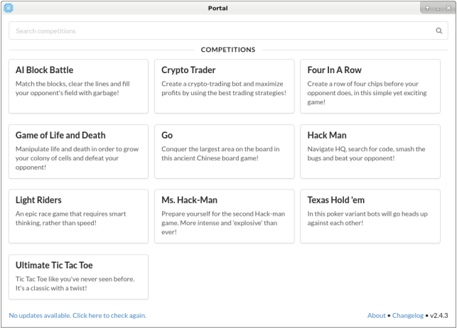
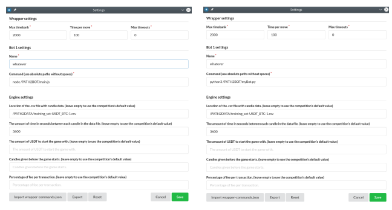
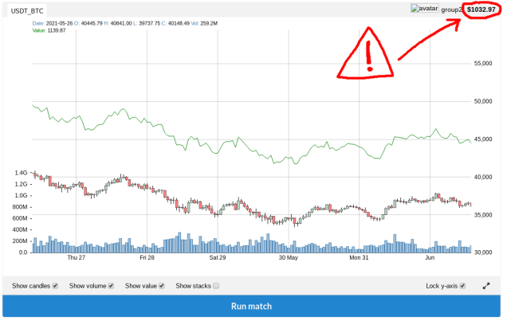
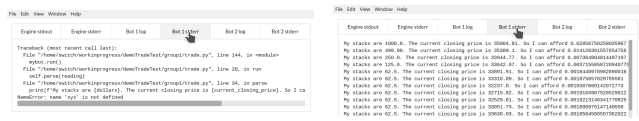
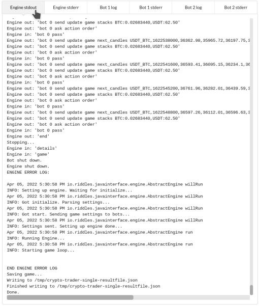

# BTC Trading Bot Project

## Overview
This project involves the development of a high-frequency trading bot capable of processing thousands of orders per second, aimed at revolutionizing the trade markets. The bot will use advanced algorithms to adapt to market changes dynamically, minimize overfitting, and maximize profits. This project also serves as a practical introduction to algorithmic trading concepts and techniques.

---

## Objectives
- Create a trading bot that operates in a simulated trading environment.
- Develop algorithms to optimize trading performance and profitability.
- Justify the bot’s performance with thorough analysis and insights.
- Compete against other bots using datasets provided during evaluation.

---

## Features
1. **Dynamic Market Adaptation**:
   - Real-time response to market changes.
   - Avoids overfitting to training datasets.
2. **Strict Decision Grammar**:
   - Implements a defined order syntax for trades.
   - Ensures all orders are valid and executable.
3. **Training and Evaluation**:
   - Utilizes training datasets and a generator for simulation.
   - Competes with other bots in a fair evaluation environment.
4. **Performance Metrics**:
   - Tracks profitability and consistency.
   - Adjusts strategies based on evaluation feedback.

---

## Project Setup
### Prerequisites
- Programming language of your choice (ensure compatibility with provided client-server interface).
- Access to training datasets and the generator provided.
- A reverse-engineering setup for analyzing server logs.

### Trading environment Setup
Let’s play around with a trading environment.


You are to craft a simple client bot, that:
- parse given information,
- make a simple forecast
- issue a sell/buy order accordingly.

The program *ai-bot-workspace* is the tool used for testing and evaluating this project.
Here’s a short guide to get you started.

Download it [from the Github source](https://github.com/jmerle/ai-bot-workspace/releases/) OR along with this subject.
   - If you’re on Linux, you should use ai-bot-workspace-2.4.3-x86_64.AppImage
   - If you’re on Windows, you sould use ai-bot-workspace-setup-2.4.3.exe

The executables launch ai-bot-workspace’s portal. There, you must select Crypto Trader


Before the first launch, you have to configure some settings:
 - the command to run your executable (interpreter + path)
 - the path to a .csv file with candlestick chart data
 - the amount of time in seconds between each candle
Below are 2 screenshots showing how it should be configured once you’re done here:


> [!WARNING]
> You are encouraged to play with all the values to test the adaptability of your bot.
The default dataset within the ai-bot-workspace contain 30-minutes candles for multiple pairs.

> [!NOTE]
> All provided datasets, as the ones used for evaluation, only contain 60-minutes candles for USDT_BTC trading pair.
The 3 last settings will be kept as default (1000 USDT, ~337 given candles before start,
0.2% transaction fee)

Now, your bot should be able to hold firm and never crash.. . but may lose a bunch of money overall


The first thing you want to check is probably your final result on the top right corner of the chart.
ot 1 stderr window will warn you in case something is going wrong. You should use this specific output to debug your bot or check what it’s doing.



The other windows, Engine stdout and Bot 1 log, will roughly provide you the same details.


Congratulations! Your environment is now fully set up.

### Installation
1. Clone the repository:
   ```bash
   git clone <repository_url>
   cd trade-bot
   ```
3. Setup the client-server interface:
   - Download the client-server bootstrap files.
   - Configure the location of your bot and command-line instructions.

### Running the Bot
1. Start the client-server interface.
2. Point the server to your bot’s executable.
3. Observe and analyze performance metrics generated by the interface.

---

## Development
### Architecture
1. **Data Input**:
   - The server provides general game settings and initial training data.
   - Live updates include market rates and account balances.
2. **Decision Logic**:
   - The bot processes input data and makes trade decisions within seconds.
   - Implements the grammar: `pass` or `buy/sell <currency_pair> <amount>`.
3. **Order Execution**:
   - Validates trades to ensure they adhere to rules and account constraints.

### Key Challenges
- Balancing trade speed with decision accuracy.
- Preventing overfitting to training datasets.
- Adapting to unseen evaluation datasets.

### Tools & Libraries
- While scientific libraries (e.g., TensorFlow, SciPy, Pandas, Numpy) are not available, custom tools can be built.
- Recommended: Python for algorithm implementation and analysis.

---

## Technical Guidelines (*in case your thinking of build a similar bot*)

### Technicalities
Transaction fee
  - by default, the bot pays a 0.2% transaction fee for each order it places
Timebank :
  - allow some additional thinking time when needed
  - start the game with 10 secs
  - each time an action is requested, the timebank is increased (100-500ms)
  - the time needed by the bot to request is deducted from the timebank
  - if the bot is too slow, the timebank will be exhausted

### BOT ORDERS
no_moves OR pass
  - you bot don’t take any position
buy CurrencyPaidWith_CurrencyReceived amount
  - amount is an integer which specifies how much to buy of the CurrencyReceived (2nd symbol)
  - buy USDT_BTC 1 means the bot wants to buy 1 BTC in USDT
  - the cost of the operation would be 1 * [current USDT_BTC closing price]
  - when buying 1 BTC, the bot will actually receive 0.998 BTC
sell CurrencyReceived_CurrencySold amount
  - amount is an integer which specifies how much to sell of the CurrencySold (2nd symbol)
  - sell USDT_BTC 1 means the bot wants to sell 1 BTC in USDT
  - the bot will received 1 * [current USDT_BTC closing price] - [fee]
  - when selling some currency for 1 USDT, the bot will actually receive 0.998 USD

### Input Format
1. **Settings**:
   ```
   settings <variable> <value>
   ```
2. **Market Rates**:
   ```
   update game next_candles <rate>;<rate>;<rate>
   ```
3. **Account Balances**:
   ```
   update game stacks <currency>:<amount>,<currency>:<amount>
   ```

### Output Format
1. **Pass Command**:
   ```
   pass
   ```
2. **Trade Command**:
   ```
   buy <currency_pair> <amount>
   sell <currency_pair> <amount>
   ```

---

## Evaluation
### Metrics
- Profitability: Total net gains across trading sessions.
- Adaptability: Performance on evaluation datasets.

### Avoid Common Pitfalls
- Overfitting deterministic algorithms.
- Invalid trades leading to program collapse.

---

## Resources
- [High-Frequency Trading Overview](https://en.wikipedia.org/wiki/High-frequency_trading)
- [Deterministic Algorithm](https://en.wikipedia.org/wiki/Deterministic_algorithm)
- [TradingView Simulator](https://www.tradingview.com/chart/?symbol=BITSTAMP%3ABTCUSD)
